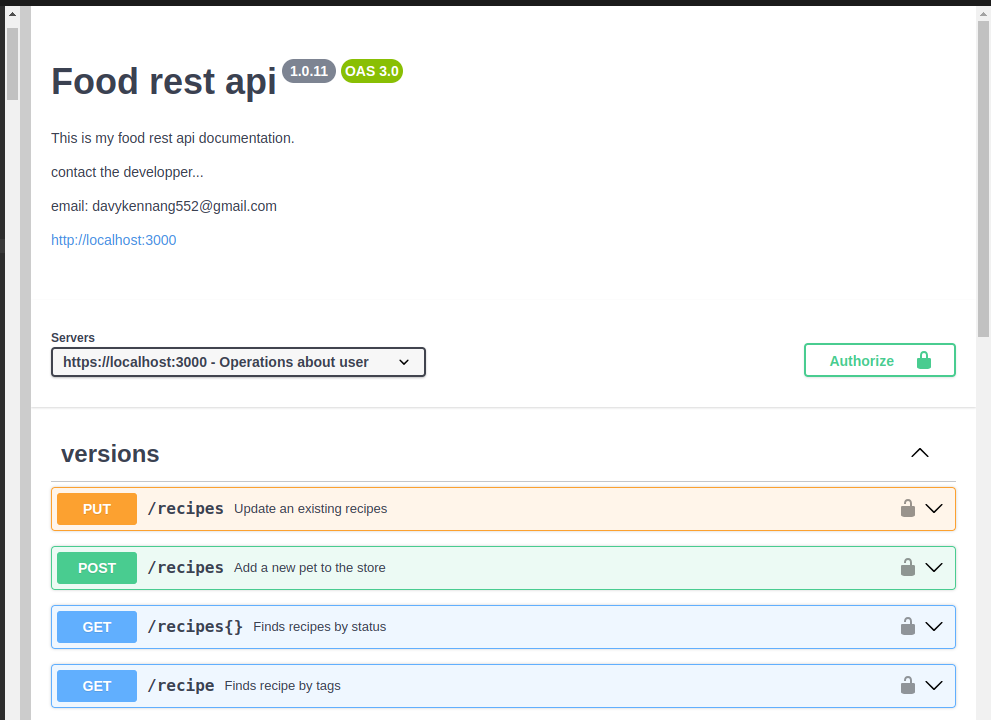

# Food_rest_API

This is a backend API for a food recipe application. It provides endpoints for managing recipes and ingredients, and it uses a PostgreSQL database for data storage.
## Requirements

    Node.js (v12 or above)
    PostgreSQL database

## Installation

    Clone the repository:
    bash

git clone https://github.com/davyken/food-rest-api.git
cd food-rest-api

## Install the dependencies:

npm install

Set up the PostgreSQL database:

    Create a new PostgreSQL database.
    Update the database connection credentials in the .env file.

Start the server:

    Terminal
    npm run dev

The API server will start running on http://localhost:3000.

## API Documentation

The API documentation is available at /api-docs endpoint. It provides detailed information about the available endpoints, request/response structures, and example usage.
Endpoints
Recipes

    GET /recipes: Get a list of all recipes.
    GET /recipes/:id: Get a specific recipe by ID.
    GET /recipes/category/:categoryId
    POST /recipes: Create a new recipe.
    PUT /recipes/:id: Update a recipe by ID.
    DELETE /recipes/:id: Delete a recipe by ID.

## Screenshots

Here are some screenshots showcasing the functionality of the Food Recipe API:

## Contributing 
Contributions are welcome! If you find any issues or have suggestions for improvements, please open an issue or submit a pull request

## License
This project is licensed under the MIT License.